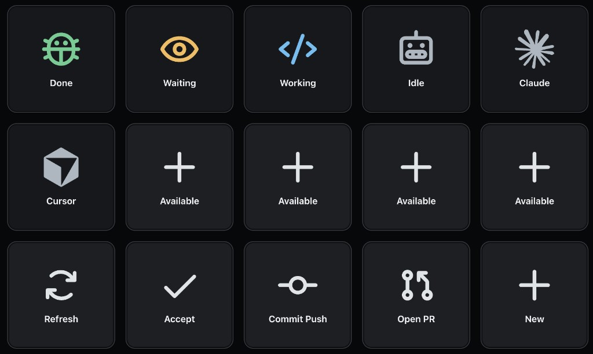

# elChango

<p align="center">
  
</p>

elChango turns a physical Stream Deck into a dedicated control surface for
native AI coding sessions on macOS. Its 15 keys show Cursor and Claude Code
sessions at a glance, then let you return to the right session, start a new one,
and run a small set of verified commands without leaving the hardware.

The physical Stream Deck MK.2 experience is the main product. You can try the
integration first with the six free keys in Stream Deck Mobile. Reproducing the
complete 5-by-3 layout on a mobile device requires Stream Deck Mobile Pro. A
browser deck is included as a fallback for setup, testing, and troubleshooting.

The app is designed to fail closed. If elChango cannot verify the provider,
session, or command target, it disables or rejects the action instead of
guessing.

## What you get

- A Stream Deck MK.2 profile with a complete 5-by-3 physical control surface.
- Support for the six-key free Stream Deck Mobile tier, with Mobile Pro required
  for the complete 5-by-3 layout.
- A native menu bar app that discovers local Cursor and Claude Code sessions.
- A browser fallback for setup, testing, and troubleshooting.
- Shared working, waiting, done, error, idle, and degraded status.
- Verified session focus and neutral new-session launch.
- Bounded commands for Accept, Open PR, Commit Push, and Compact when the
  selected provider and session support them.

<p align="center">
  
</p>

## Requirements

- macOS 14 or newer.
- Cursor and/or Claude Desktop with Claude Code sessions.
- Accessibility permission for session focus and commands.
- Stream Deck 7.1 or newer for Stream Deck Mobile or the physical surface.

The release app is Universal 2 and runs on Apple Silicon and Intel Macs. Python,
Node.js, and Xcode are not required for normal use.

## Install

### Homebrew

```bash
brew install --cask jychp/tap/elchango
```

### GitHub release

Download `elChango-X.Y.Z-macos-universal.zip` and its checksum from the
[latest GitHub release](https://github.com/jychp/elchango/releases/latest).
Verify the archive:

```bash
shasum -a 256 -c elChango-X.Y.Z-macos-universal.zip.sha256
```

Extract the archive and move `elChango.app` to `/Applications`. Official
release apps are signed with Developer ID and notarized by Apple.

## First launch

1. Open `/Applications/elChango.app`.
2. Choose the grid icon in the macOS menu bar.
3. Choose **Request Accessibility Access** and approve elChango in **System
   Settings > Privacy & Security > Accessibility**.
4. Complete the [Stream Deck setup](#stream-deck-setup) with Stream Deck Mobile
   or a physical Stream Deck.
5. Install the [provider plugin](#install-provider-plugins) for each provider
   you use.
6. Use **Open Web Deck** from the menu only when you need the browser fallback
   for setup, testing, or troubleshooting.

The menu's **Diagnostics** item shows the app version, local service status,
Accessibility status, and provider availability. Only one stable or debug
instance can use the local service at a time.

### Why Accessibility is required

Accessibility lets elChango inspect the frontmost supported app, verify the
selected session and input target, focus a session, and dispatch its fixed
commands. It does not allow browser or Stream Deck clients to submit arbitrary
prompt text, scripts, shell commands, or shortcuts.

If macOS does not retain permission after an app update or move, remove the old
elChango entry in Accessibility settings, keep the app at
`/Applications/elChango.app`, reopen it, and grant access again.

## Stream Deck setup

Download the `.streamDeckPlugin` file from the matching
[GitHub release](https://github.com/jychp/elchango/releases), then double-click
it. The package installs the plugin and an `elChango` Stream Deck MK.2 profile
with all 15 keys populated.

The free Stream Deck Mobile tier exposes six keys, which is enough to test the
plugin before buying physical hardware. Stream Deck Mobile Pro is required to
use a 5-by-3 mobile layout and expose the full 15-key workflow. The browser deck
remains available when you need a complete setup or troubleshooting fallback.

The profile stores positions, not session identities. Before each action, the
plugin requests a fresh button ID and revision from the local app. See the
[Stream Deck guide](plugins/streamdeck/README.md) for runtime details.

## Install provider plugins

Provider plugins add low-latency lifecycle updates. They fail open, so an
unavailable elChango app does not block your coding agent.

### Cursor

The Cursor plugin is intended for the public Cursor Marketplace. Until it is
listed, individual users can install it from a local clone:

```bash
mkdir -p ~/.cursor/plugins/local
ln -s /path/to/elchango/plugins/cursor ~/.cursor/plugins/local/elchango
```

Restart Cursor or run **Developer: Reload Window**, then confirm that
`elchango` appears in Customize and in the Hooks panel. Team and Enterprise
organizations can import `https://github.com/jychp/elchango` through their
managed Team Marketplace.

The plugin expects the app at `/Applications/elChango.app`. See the
[Cursor plugin guide](plugins/cursor/README.md) for its event and privacy
boundaries.

### Claude Code

```bash
claude plugin marketplace add jychp/elchango
claude plugin install elchango@elchango
```

Start elChango before beginning or resuming a Claude Code session. See the
[Claude Code plugin guide](plugins/claude/README.md) for hook coverage.

## Use and personalize the deck

- Select a session to bring its verified provider window and session forward.
- Select **Available** or **New** to choose a provider and open its neutral new
  session view. elChango does not submit a prompt.
- Use **Refresh** to reorder sessions by recent activity.
- Use **Previous** and **Next** to move through more than ten sessions.
- Select an enabled command to run it against the currently verified target.
  A disabled command means that the required target or capability is not
  available.
- Press and hold a session key to choose its icon.
- Press and hold one of the three command keys to change its command.

Browser and Stream Deck pagination and provider selection are independent.
Session icons and command placement are shared and persist between launches.

## Troubleshooting

**The menu says the service is unavailable**

Quit any other stable or debug elChango instance, reopen the app, and check
**Diagnostics**. Both profiles use `127.0.0.1:8765`.

**The deck shows the sleeping monkey**

Confirm that elChango is running and reopen the browser deck from the menu. Do
not bookmark or reuse its one-time bootstrap URL.

**A provider is missing or stale**

Confirm the provider is installed and has a persistent local session. Install
or reload its plugin, then use **Refresh**. Provider format changes may cause
elChango to degrade rather than infer a session from ambiguous data.

**Focus or commands are disabled**

Grant Accessibility access, bring the expected provider forward, and select
the exact session again. Commands remain disabled when elChango cannot verify
the selected session or expected input target.

**An action failed**

Check that the provider stayed frontmost and the selected session did not
change during dispatch. elChango does not automatically retry ambiguous
actions.

For reproducible problems, use the [support policy](SUPPORT.md). Report
vulnerabilities privately as described in [SECURITY.md](SECURITY.md).

## Privacy

elChango runs locally and binds only to `127.0.0.1`. It has no telemetry
service and does not send provider content to an elChango server.

Provider stores are read without modification. Hooks discard prompt text,
responses, tool content, notification messages, email, and transcript content.
The app stores its control token and your deck preferences under
`~/Library/Application Support/elChango/`.

The browser receives an authenticated session through a short-lived,
single-use URL. Stream Deck uses an owner-only local token. Read the
[security model](docs/security.md) for trust boundaries, limitations, and
token handling. Vulnerabilities are reported through
[SECURITY.md](SECURITY.md).

## Uninstall

1. Quit elChango.
2. Remove the Cursor and Claude Code plugins using their provider's plugin
   manager.
3. Remove the elChango plugin in Stream Deck preferences, if installed.
4. Delete `/Applications/elChango.app`.
5. To remove preferences and the local control token, delete
   `~/Library/Application Support/elChango/`.
6. Remove elChango from **System Settings > Privacy & Security >
   Accessibility**.

## License and branding

The software and documentation are available under the
[MIT License](LICENSE). Bundled dependency licenses are recorded in
[THIRD_PARTY_NOTICES.md](THIRD_PARTY_NOTICES.md).

The elChango name, monkey logo, application icon, screensaver artwork, and
other project branding are not licensed under MIT. See
[TRADEMARKS.md](TRADEMARKS.md) for permitted use and the third-party
non-affiliation statement.

Development setup and contribution standards are in
[CONTRIBUTING.md](CONTRIBUTING.md).
